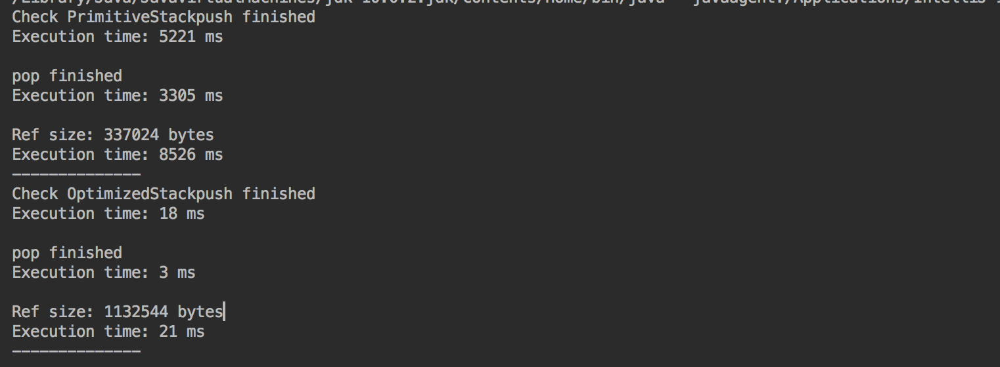

## Решения

- PrimitiveStack - stack c примитивным int
- WrapperStack - stack c Wrapper Class Integer
- OptimizedStack - оптимизированный stack (нет копирования данных, размер массива задан заранее)
- StackTest - тесты на все 3 класса, покрытие 100%

## СИСТЕМА ОЦЕНИВАНИЯ
- [x] +1 балл - просмотрен вебинар и/или запись
- [x] +1 балл - создан Maven проект с интерфейсом IStack
- [x] +2 балла - реализована работа стека по описанию
- [x] +2 балла - созданы тесты со 100% покрытием кода
- [x] +2 балла - проведены эксперименты с 10^N нагрузкой
- [x] +1 балл - придумана и реализована оптимизация
- [x] +1 балл - создан скриншот с результатами тестирования

## Скриншот

